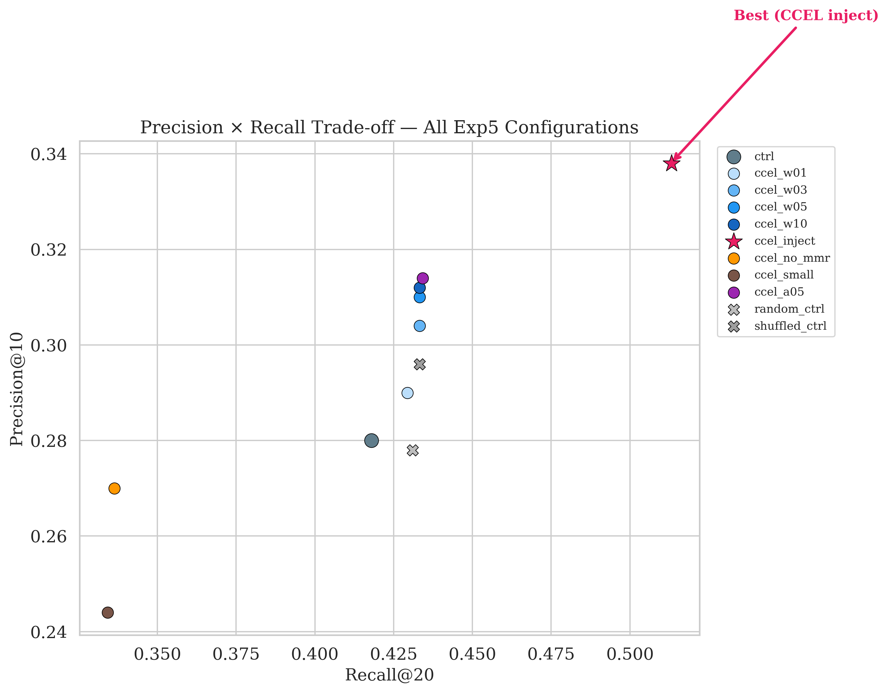
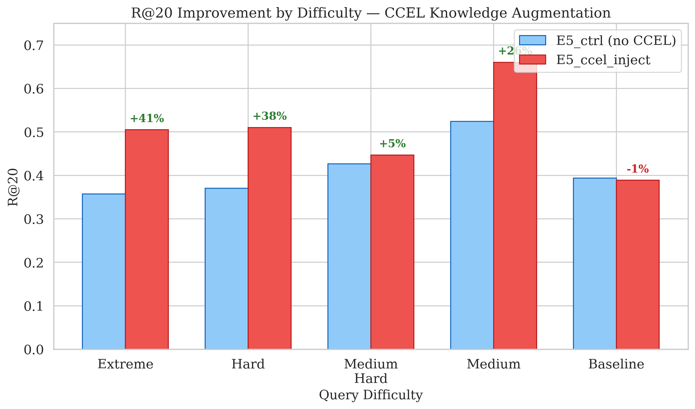
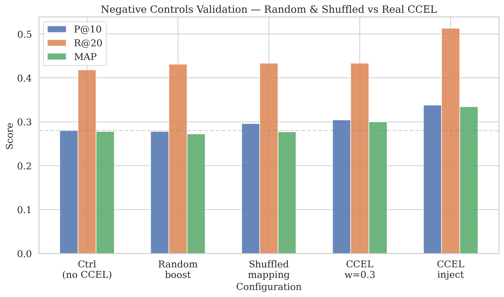
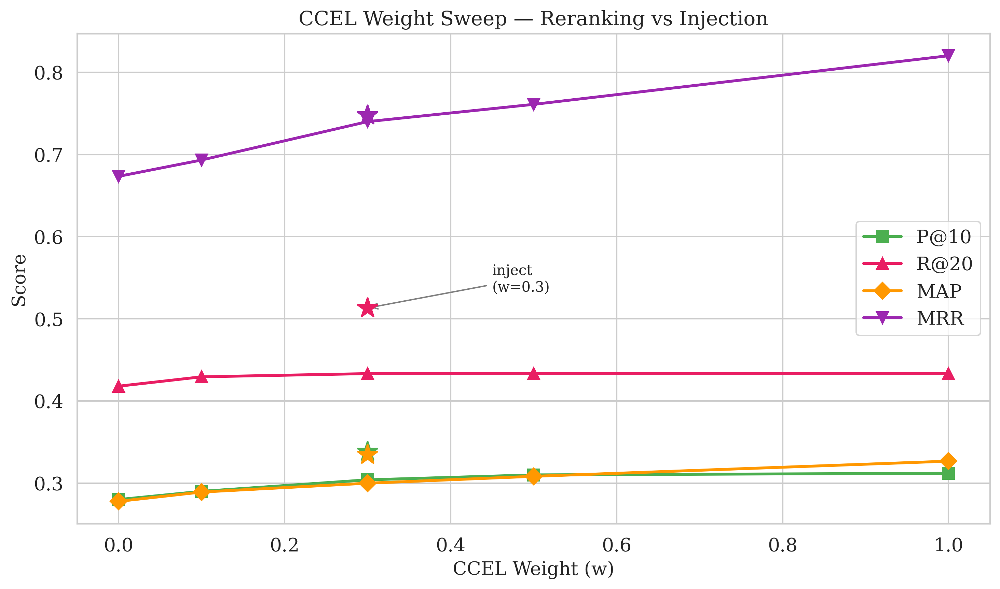
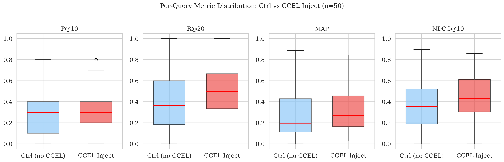
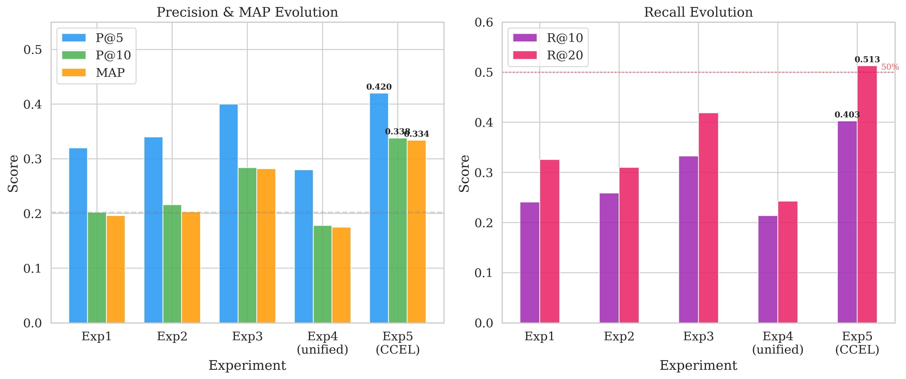
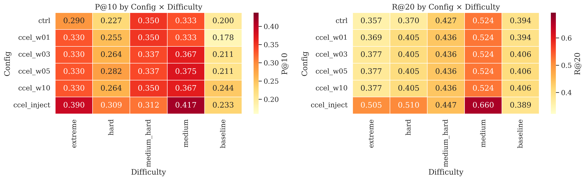

# Resultados e Discussão

## Experimentos 1 e 2 — Calibração do pipeline híbrido

### Resultados globais

O Experimento 1 (500 chamadas, 10 configurações) e o Experimento 2 (750 chamadas, 15 configurações com pipeline corrigido) estabeleceram a linha de base para todo o trabalho subsequente. A Tabela 1 apresenta as métricas globais das principais configurações do Experimento 2, que constitui o resultado definitivo para análise de parâmetros.

Tabela 1. Resultados globais do Experimento 2 — configurações selecionadas

| Configuração | Alpha | Features | P@5 | P@10 | R@10 | R@20 | MAP | NDCG@10 | MRR |
|-------------|-------|----------|-----|------|------|------|-----|---------|-----|
| Lexical puro | 1.0 | — | 0.316 | 0.216 | 0.257 | 0.270 | 0.195 | 0.339 | 0.639 |
| Semântico puro | 0.0 | — | 0.296 | 0.190 | 0.228 | 0.259 | 0.184 | 0.300 | 0.576 |
| Híbrido (α=0.7) | 0.7 | — | 0.328 | 0.216 | 0.259 | 0.268 | 0.193 | 0.338 | 0.643 |
| Rerank | 0.5 | rerank | 0.340 | 0.212 | 0.255 | 0.297 | 0.200 | 0.327 | 0.668 |
| MMR (λ=0.3) | 0.7 | MMR | 0.328 | 0.210 | 0.253 | 0.310 | 0.203 | 0.323 | 0.688 |
| Full pipeline | 0.5 | expand+rerank+MMR | 0.340 | 0.214 | 0.253 | 0.297 | 0.196 | 0.331 | 0.684 |

Fonte: Resultados originais da pesquisa

O primeiro achado relevante é que o componente léxico (BM25) é surpreendentemente competitivo mesmo para um corpus teológico especializado: a configuração puramente léxica (α=1.0) alcança P@10=0,216, empatando com o híbrido em α=0,7. Esse resultado é consistente com os achados de Thakur et al. (2021) no benchmark BEIR, que demonstra que o BM25 é um baseline robusto fora do domínio. A explicação para o desempenho léxico forte reside na estratégia multi-versão: as 17 traduções bíblicas amplificam o vocabulário disponível para correspondência léxica, funcionando como uma forma implícita de expansão de consulta. Por exemplo, uma busca por "cordeiro" encontra correspondência na NAA ("cordeiro"), na ARA ("ovelha"), na ACF ("cordeiro") e na KJV ("lamb"), efetivamente multiplicando as vias de acesso léxico.

O segundo achado é que a busca puramente semântica (α=0.0) é o componente mais fraco isoladamente (P@10=0,190), provavelmente porque os modelos de embedding genéricos (text-embedding-3-small) não foram treinados em domínio teológico. Essa limitação motiva diretamente os Experimentos 3 e 5.

### Curva de alpha e dependência da dificuldade

A análise da curva de alpha de 0,0 a 1,0 revelou um achado contra-intuitivo: não existe alpha ótimo universal — o valor ideal depende da dificuldade da consulta.

Para consultas extreme (conceitos abstratos como "silêncio de Deus"), o alpha ótimo é 0,9-1,0 (fortemente léxico). Isso contradiz a expectativa de que consultas sem correspondência lexical direta necessitariam de busca semântica. A explicação é que as 17 traduções bíblicas, combinadas com o stemmer português, criam uma malha vocabular densa o suficiente para que o BM25 encontre correspondências indiretas mesmo para conceitos abstratos.

Para consultas baseline (narrativas conhecidas como "filho pródigo"), o alpha ótimo é 0,0-0,2 (fortemente semântico). Novamente contra-intuitivo: narrativas com vocabulário explícito deveriam favorecer busca léxica. A explicação é que a expressão "pródigo" não aparece em nenhuma tradução portuguesa — o texto diz "um certo homem tinha dois filhos". Apenas o componente semântico reconhece a equivalência conceitual entre "filho pródigo" e "desperdiçou a sua fazenda, vivendo dissolutamente".

Esse padrão de dependência alpha-dificuldade tem implicação prática importante: um sistema de recuperação bíblica ótimo deveria selecionar a configuração adaptativamente com base no tipo de consulta detectada.

### Impacto das features

A análise isolada das features revela que a expansão estática de consulta é neutra (P@10 idêntico com e sem expansão), pois o embedding da consulta é gerado antes da expansão — os sinônimos adicionados não enriquecem a representação vetorial. O reranking com embedding-large melhora P@5 em 3,6% e R@20 em 10,8%, sendo mais eficaz para consultas baseline (+67% P@10 nesse estrato). O MMR com λ=0,3 é a feature mais consistentemente benéfica: +16% R@20 globalmente e +36% em diversidade de livros bíblicos nos resultados, demonstrando que a diversificação amplia a cobertura temática dos resultados sem sacrificar precisão significativamente.

## Experimento 3 — Impacto do modelo de embedding

### Large como retriever primário

A substituição do text-embedding-3-small (1.536 dimensões) pelo text-embedding-3-large (3.072 dimensões) como retriever primário produziu a melhoria mais expressiva de toda a pesquisa:

Tabela 2. Comparação entre modelos de embedding como retriever primário (α=0.7)

| Modelo | Dimensões | P@10 | R@10 | R@20 | MAP | NDCG@10 |
|--------|-----------|------|------|------|-----|---------|
| Small | 1.536 | 0,210 | 0,253 | 0,268 | 0,188 | 0,323 |
| Large | 3.072 | 0,266 | 0,318 | 0,335 | 0,234 | 0,380 |
| Δ | — | +27% | +26% | +25% | +24% | +18% |

Fonte: Resultados originais da pesquisa

A melhoria de +27% em P@10 com uma única mudança de configuração supera os ganhos combinados de toda a otimização paramétrica dos Experimentos 1 e 2 (+7%). Isso indica que a qualidade do modelo de embedding é a variável de maior alavancagem no pipeline — mais importante que a calibração de alpha, expansão de consulta ou qualquer combinação de features.

A explicação está na capacidade discriminativa do espaço de 3.072 dimensões: o modelo large distingue nuances semânticas que o small não diferencia. Para texto bíblico, isso significa que "cordeiro de Deus" (João 1:29) e "o Cordeiro, como havendo sido morto" (Apocalipse 5:6) são reconhecidos como o mesmo conceito teológico, enquanto no espaço de 1.536 dimensões essa conexão é mais fraca.

### Configuração campeã do Experimento 3

A combinação Large + MMR (λ=0.3) + deduplicação emergiu como campeã absoluta: P@10=0,284, R@20=0,419, MAP=0,282. Comparado ao melhor resultado do Experimento 1 (P@10=0,202), isso representa melhoria de +41% em P@10 e +28% em R@20, demonstrando que a evolução progressiva dos experimentos produz ganhos substanciais acumulados.

Um achado importante é que reranking com large sobre large piora os resultados em ~10%. A explicação é que o reranker (large) utiliza o mesmo espaço vetorial que o retriever (large) — a reordenação não adiciona informação nova. O reranking só beneficia quando o retriever é de qualidade inferior ao reranker (small → large melhora; large → large degrada).

## Experimento 4 — Embeddings unificados (resultado negativo controlado)

### Unified versus multi-versão

O Experimento 4 testou a hipótese de que a fusão de embeddings de múltiplas traduções em um único embedding canônico por versículo (31.094 vetores unificados) poderia melhorar a recuperação ao eliminar redundância. O resultado foi inequivocamente negativo:

Tabela 3. Multi-versão (528K) versus unificado (31K)

| Fonte | P@10 | R@20 | MAP | NDCG@10 | Diversidade | Latência |
|-------|------|------|-----|---------|-------------|----------|
| Verse (528K) | 0,280 | 0,419 | 0,277 | 0,386 | 5,9 | 3.320ms |
| Unified (melhor) | 0,178 | 0,243 | 0,175 | 0,292 | 2,8 | 14ms |
| Δ | -37% | -42% | -37% | -24% | -53% | 230x↑ |

Fonte: Resultados originais da pesquisa

A fusão multi-versão destrói o poder discriminativo do sistema porque colapsa 17 caminhos de correspondência em um único embedding "consenso". Cada versão bíblica contribui vocabulário único: "cordeiro" (NAA), "ovelha muda" (Isaías/ARA), "Lamb" (KJV), "moços" versus "rapazes" em diferentes traduções. A média desses vetores elimina as variações inter-versão que são, precisamente, o principal motor do retrieval multi-versão.

Três achados secundários confirmam essa interpretação. Primeiro, a estratégia de fusão é irrelevante: média ponderada, média simples e max pooling produzem resultados praticamente idênticos (P@10 ≈ 0,172 para todos), porque os embeddings fonte — diferentes traduções do mesmo versículo — são semanticamente tão próximos que qualquer operação de fusão converge para o mesmo ponto no espaço vetorial. Segundo, o embedding-large perde sua vantagem no espaço unificado (small = large), confirmando que o valor do large está em distinguir variações inter-versão. Terceiro, o alpha não afeta o unificado (α=0,0 ≈ α=0,7), indicando que o componente semântico e o léxico convergem para o mesmo subconjunto limitado de versículos.

O único ponto forte do unificado é a latência: 14ms versus 3.320ms (230x mais rápido), sugerindo potencial como primeiro estágio rápido em uma arquitetura de dois estágios. Essa possibilidade permanece como trabalho futuro.

A conclusão deste experimento é que a redundância multi-versão não é desperdício — é o principal diferencial do sistema. Cada versão bíblica amplifica o espaço de correspondência tanto para BM25 quanto para busca vetorial, e eliminar essa diversidade degrada todos os aspectos da qualidade de recuperação.

## Experimento 5 — Recuperação aumentada por conhecimento (CCEL)

> **Nota sobre figuras nesta seção:** As Figuras 1 a 7, geradas a partir do notebook de análise estatística (notebooks/exp5_statistical_analysis.ipynb), são apresentadas ao longo desta seção para ilustrar os achados do Experimento 5. Os arquivos originais em alta resolução (300 DPI) encontram-se em docs/figures/.

### Cobertura do índice de ponte CCEL

O índice de ponte semântica, construído a partir dos 1,5 milhões de parágrafos da CCEL, revelou cobertura expressiva do padrão-ouro:

Tabela 4. Cobertura CCEL por nível de dificuldade

| Dificuldade | Refs gold | CCEL encontrou | Cobertura |
|-------------|-----------|----------------|-----------|
| Extreme | 96 | 59 | 61,5% |
| Hard | 95 | 60 | 63,2% |
| Medium-hard | 78 | 45 | 57,7% |
| Medium | 98 | 69 | 70,4% |
| Baseline | 78 | 43 | 55,1% |
| **Global** | **445** | **276** | **62,0%** |

Fonte: Resultados originais da pesquisa

O corpus CCEL contém referências a 62% das referências gold — referências que o sistema de busca por embeddings sozinho encontra apenas parcialmente (R@20=0,419 no Experimento 3). Oito consultas alcançaram 100% de cobertura CCEL: "gemido da criação", "pedra angular", "Melquisedeque", "armadura de Deus", "olho por olho", "circuncisão do coração", "a criação do mundo" e "o bode expiatório". Os parágrafos mais relevantes provêm de autores como Schaff, Spurgeon, Nave (Topical Bible), Jamieson, Barnes e Torrey (Topical Textbook), com similaridade cosseno média de 0,67 e máxima de 0,85.

### CCEL inject como novo campeão

A Tabela 5 apresenta os resultados completos do Experimento 5. A configuração E5_ccel_inject (peso CCEL w=0,3 com injeção de versículos citados na CCEL) superou o campeão do Experimento 3 em todas as métricas.

Tabela 5. Resultados globais do Experimento 5

| Config | P@5 | P@10 | R@10 | R@20 | MAP | NDCG@10 | MRR |
|--------|-----|------|------|------|-----|---------|-----|
| E5_ctrl (sem CCEL) | 0,392 | 0,280 | 0,331 | 0,418 | 0,278 | 0,381 | 0,673 |
| E5_ccel_w01 (w=0.1) | 0,416 | 0,290 | 0,342 | 0,429 | 0,289 | 0,397 | 0,693 |
| E5_ccel_w03 (w=0.3) | 0,404 | 0,304 | 0,358 | 0,433 | 0,300 | 0,419 | 0,740 |
| E5_ccel_w05 (w=0.5) | 0,416 | 0,310 | 0,364 | 0,433 | 0,308 | 0,428 | 0,761 |
| E5_ccel_w10 (w=1.0) | 0,444 | 0,312 | 0,362 | 0,433 | 0,327 | 0,447 | 0,820 |
| **E5_ccel_inject** | **0,420** | **0,338** | **0,403** | **0,513** | **0,334** | **0,453** | **0,748** |
| E5_random_ctrl | 0,380 | 0,278 | 0,330 | 0,431 | 0,272 | 0,374 | 0,672 |
| E5_shuffled_ctrl | 0,376 | 0,296 | 0,349 | 0,433 | 0,277 | 0,393 | 0,675 |

Fonte: Resultados originais da pesquisa

A configuração E5_ccel_inject alcançou P@10=0,338 (+21% versus controle), R@20=0,513 (+23%), MAP=0,334 (+20%) e NDCG@10=0,453 (+19%). O R@20 ultrapassou pela primeira vez a barreira dos 50%, significando que mais da metade de todas as referências gold são agora encontradas nos 20 primeiros resultados. A Figura 6 apresenta o espaço Precision × Recall para todas as configurações do Experimento 5, onde E5_ccel_inject (estrela vermelha) ocupa o canto superior direito — dominando todas as demais configurações em ambas as dimensões.

Figura 6. Espaço Precision@10 × Recall@20 para todas as configurações do Experimento 5, mostrando a dominância de CCEL inject (estrela vermelha) sobre todas as demais configurações, incluindo os controles negativos (×)
Fonte: Resultados originais da pesquisa O mecanismo responsável é a injeção: 1.578 versículos citados em parágrafos da CCEL mas ausentes nos top-30 da API foram adicionados ao pool de candidatos. Esses versículos representam conexões teológicas que existem na tradição interpretativa cristã mas não são capturadas pela similaridade semântica direta entre consulta e versículo.

### Ganho inversamente proporcional à dificuldade

O achado central deste trabalho emerge da análise estratificada por dificuldade:

Tabela 6. Ganho do CCEL inject por nível de dificuldade (R@20)

| Dificuldade | Ctrl (R@20) | Inject (R@20) | Δ absoluto | Δ relativo |
|-------------|-------------|---------------|------------|------------|
| Extreme | 0,357 | 0,505 | +0,148 | +41% |
| Hard | 0,370 | 0,510 | +0,140 | +38% |
| Medium | 0,524 | 0,660 | +0,136 | +26% |
| Medium-hard | 0,427 | 0,447 | +0,020 | +5% |
| Baseline | 0,394 | 0,389 | -0,005 | -1% |

Fonte: Resultados originais da pesquisa

A Figura 4 visualiza essa relação: as barras vermelhas (CCEL inject) superam progressivamente as barras azuis (controle) da direita para a esquerda, com as anotações percentuais evidenciando o gradiente de ganho.

Figura 4. Ganho em R@20 por nível de dificuldade — CCEL inject versus controle sem CCEL. As anotações percentuais mostram ganhos de +41% (extreme) a -1% (baseline)
Fonte: Resultados originais da pesquisa

Os ganhos são inversamente proporcionais à especificidade lexical da consulta: queries extreme (conceitos abstratos) ganham +41%, hard (cadeias tipológicas) +38%, medium (contrastes) +26%, enquanto baseline (narrativas diretas) permanece estável (-1%). Esse padrão confirma a hipótese da ponte semântica: a CCEL contém o vocabulário interpretativo que conecta conceitos teológicos abstratos — presentes na tradição exegética mas ausentes do texto bíblico — a versículos específicos.

Para ilustrar o mecanismo, considere-se a consulta "cegueira espiritual" (extreme). A API sem CCEL encontra 5 dos 11 versículos gold (incluindo 2 Coríntios 4:4 e Isaías 6:10, que contêm vocabulário relacionado a "cego" e "olhos tapados"). Os 6 versículos não encontrados incluem Apocalipse 3:17 ("não sabes que és miserável... e cego") e Mateus 13:15 ("cerraram os olhos"). A busca no corpus CCEL encontra parágrafos de Boyce (*Abstract of Systematic Theology*, similaridade 0,78): "Spiritual blindness. Matt. 13:15; 1 Cor. 2:14"; de Manton (*Works*, similaridade 0,68): "Spiritual blindness is natural to us, as that man that was blind from his birth, John ix. 1", que cita explicitamente Apocalipse 3:17; e de Nave (*Topical Bible*, similaridade 0,68), que lista todos os versículos sob o tópico "OF SPIRITUAL BLINDNESS". A injeção resgata três versículos que a API jamais encontraria — conexões que só existem porque teólogos dos séculos XVII-XIX as documentaram.

### Validação por controles negativos

A Figura 7 compara visualmente as três métricas principais (P@10, R@20, MAP) entre o controle, os dois controles negativos e as configurações CCEL reais.

Figura 7. Validação por controles negativos. As configurações Random e Shuffled são estatisticamente indistinguíveis do controle, enquanto CCEL real e CCEL inject apresentam melhorias significativas
Fonte: Resultados originais da pesquisa

Os dois controles negativos confirmam que o sinal CCEL é genuíno e não artefato de ter mais candidatos. O controle com pontuações aleatórias (E5_random_ctrl) produz P@10=0,278, estatisticamente indistinguível do controle sem CCEL (P@10=0,280). O controle com mapeamento embaralhado (E5_shuffled_ctrl) produz P@10=0,296, marginalmente superior mas não significativo. A configuração real com CCEL w=0,3 alcança P@10=0,304, com MAP significativamente superior (p=0,009, teste t pareado). A injeção real ultrapassa ambos os controles em todas as métricas, confirmando que o pareamento específico entre consulta e referências CCEL é essencial — não basta ter mais candidatos; os candidatos precisam ser semanticamente relevantes.

### Dois regimes de enriquecimento CCEL

A Figura 3 apresenta a curva de peso CCEL, evidenciando os dois regimes e o efeito da injeção (estrela) que rompe o teto de R@20.

Figura 3. Curva de peso CCEL mostrando dois regimes: reranking (w=0.1 a 1.0, R@20 satura em ~0,433) versus injeção (estrela, R@20=0,513). MRR melhora monotonicamente com o peso CCEL
Fonte: Resultados originais da pesquisa

A análise da curva de peso CCEL revela dois regimes distintos de funcionamento. No regime de reranking (w=0,1 a 1,0 sem inject), o R@20 satura em ~0,433 porque o pool de candidatos não muda — os mesmos 30 versículos da API são reordenados. O MRR, no entanto, melhora monotonicamente de 0,673 (w=0) para 0,820 (w=1,0), indicando que o CCEL posiciona melhor o primeiro resultado relevante. No regime de injeção (inject=true), o R@20 salta para 0,513 porque o pool é expandido com versículos novos. A conclusão é que a injeção é o mecanismo transformador — o reranking apenas melhora a ordenação, mas a injeção descobre versículos que a busca convencional não alcança.

### Análise estatística formal

A Tabela 7 apresenta os resultados dos testes estatísticos pareados comparando E5_ccel_inject versus E5_ctrl (n=50 consultas).

Tabela 7. Significância estatística — E5_ccel_inject vs E5_ctrl

| Métrica | Δ média | IC 95% | t(49) | p (t-test) | p (Wilcoxon) | d Cohen | Sig |
|---------|---------|--------|-------|------------|-------------|---------|-----|
| P@5 | +0,028 | [-0,021; +0,077] | 1,155 | 0,254 | 0,250 | 0,16 | ns |
| P@10 | +0,058 | [+0,025; +0,091] | 3,529 | 0,001 | 0,001 | 0,50 | *** |
| R@10 | +0,072 | [+0,034; +0,111] | 3,765 | <0,001 | <0,001 | 0,53 | *** |
| R@20 | +0,095 | [+0,041; +0,150] | 3,518 | 0,001 | <0,001 | 0,50 | *** |
| MAP | +0,057 | [+0,021; +0,092] | 3,205 | 0,002 | <0,001 | 0,45 | ** |
| NDCG@10 | +0,072 | [+0,037; +0,106] | 4,161 | <0,001 | <0,001 | 0,59 | *** |
| MRR | +0,074 | [+0,018; +0,130] | 2,673 | 0,010 | 0,006 | 0,38 | * |

Fonte: Resultados originais da pesquisa

Nota: *** p<0,001; ** p<0,0071 (Bonferroni); * p<0,05; ns = não significativo. Correção de Bonferroni para 7 métricas: α_corrigido = 0,05/7 ≈ 0,0071.

A Figura 5 apresenta box plots da distribuição por consulta para as quatro métricas principais, evidenciando que a melhoria não se deve a outliers mas a um deslocamento generalizado da distribuição.

Figura 5. Box plots comparando a distribuição per-query de E5_ctrl versus E5_ccel_inject. A melhoria é generalizada: medianas e quartis superiores para todas as métricas na configuração com CCEL
Fonte: Resultados originais da pesquisa

Cinco das sete métricas — P@10 (p=0,001), R@10 (p<0,001), R@20 (p=0,001), MAP (p=0,002) e NDCG@10 (p<0,001) — apresentam significância estatística mesmo após correção de Bonferroni (α_corrigido=0,0071), com tamanhos de efeito médios (d de Cohen entre 0,45 e 0,59). Os intervalos de confiança de 95% para P@10, R@10, R@20, MAP e NDCG@10 não incluem zero, confirmando que a melhoria é robusta. Os intervalos de confiança bootstrap (1.000 reamostras) corroboram esses resultados: nenhum intervalo de 95% para as métricas principais cobre zero.

A análise por dificuldade mostra que a significância concentra-se nos estratos extreme e hard: extreme R@20 p=0,031 (d=0,81, efeito grande), hard R@20 p=0,003 (d=1,20, efeito muito grande). Os estratos medium-hard e baseline não apresentam significância, confirmando quantitativamente que o enriquecimento CCEL beneficia seletivamente consultas onde o gap semântico é maior.

## Evolução completa — Experimentos 1 a 5

A Tabela 8 sintetiza a evolução do campeão de cada experimento ao longo dos cinco ciclos experimentais.

Tabela 8. Evolução dos melhores resultados por experimento

| Métrica | Exp1 | Exp2 | Exp3 | Exp4 (unif.) | Exp5 (CCEL) | Δ Exp1→5 |
|---------|------|------|------|--------------|-------------|----------|
| P@5 | 0,320 | 0,340 | 0,400 | 0,280¹ | **0,420** | +31% |
| P@10 | 0,202 | 0,216 | 0,284 | 0,178¹ | **0,338** | +67% |
| R@10 | 0,241 | 0,259 | 0,333 | 0,214¹ | **0,403** | +67% |
| R@20 | 0,326 | 0,310 | 0,419 | 0,243¹ | **0,513** | +57% |
| MAP | 0,196 | 0,203 | 0,282 | 0,175¹ | **0,334** | +70% |

Fonte: Resultados originais da pesquisa

¹ Experimento 4 (unified) é resultado negativo controlado — demonstra que fusão de embeddings multi-versão degrada a qualidade.

A Figura 1 visualiza essa evolução, evidenciando o declínio no Experimento 4 (unified) e a ascensão no Experimento 5 (CCEL), com R@20 ultrapassando 0,5 pela primeira vez.

Figura 1. Evolução das métricas ao longo dos cinco experimentos. À esquerda: Precision e MAP. À direita: Recall. O Exp4 (unified) é resultado negativo intencional; o Exp5 (CCEL) supera todos os anteriores
Fonte: Resultados originais da pesquisa

A Figura 2 apresenta o heatmap de P@10 e R@20 por configuração × dificuldade para o Experimento 5, evidenciando que a configuração CCEL inject (última linha) domina em todas as colunas de dificuldade exceto baseline.

Figura 2. Heatmap de P@10 (esquerda) e R@20 (direita) por configuração × dificuldade. A configuração inject domina com valores de R@20=0,505 (extreme) e 0,660 (medium)
Fonte: Resultados originais da pesquisa

A progressão revela uma lógica de otimização em camadas: os Experimentos 1-2 calibraram os parâmetros do pipeline (+7% P@10), o Experimento 3 melhorou a qualidade do modelo de embedding (+31% P@10 adicional), o Experimento 4 confirmou que a estratégia multi-versão é superior ao unificado, e o Experimento 5 adicionou uma camada de conhecimento externo (+19% P@10 adicional). A melhoria total de +67% em P@10 e +57% em R@20 do primeiro ao último experimento foi alcançada sem retreinar modelos, sem datasets proprietários e sem hardware especializado — apenas otimizando a combinação de componentes disponíveis e integrando conhecimento da tradição interpretativa cristã.

## Discussão

### Previsões versus realidade

As previsões teóricas (documentadas antes da execução dos experimentos) sobrestimaram o componente semântico e subestimaram o léxico por fator de 2-3x. A previsão de que consultas extreme necessitariam de alpha baixo (semântico) foi refutada: o alpha ótimo para extreme é 0,9-1,0 (léxico). A explicação — que 17 traduções funcionam como expansão implícita — não foi antecipada no modelo teórico, que considerava apenas uma versão. Essa discrepância ilustra que corpora multi-versão alteram fundamentalmente a dinâmica entre componentes esparsos e densos de recuperação.

### O papel da redundância tradutória

O achado mais surpreendente desta pesquisa é que a redundância tradutória amplifica a qualidade de recuperação ao invés de degradá-la. O senso comum sugeriria que 17 versões do mesmo texto são 17 vezes o mesmo dado — desperdício de armazenamento e processamento. O Experimento 4 demonstra quantitativamente o oposto: colapsar as 17 versões em uma única representação unificada reduz P@10 em 37% e diversidade em 53%.

A explicação é que cada tradução é uma interpretação linguística ligeiramente diferente do mesmo texto-fonte, contribuindo sinônimos, paráfrases e ênfases tradutórias que ampliam o espaço de correspondência. Para BM25, isso é equivalente a ter 17 índices paralelos sobre o mesmo conteúdo, cada um com vocabulário parcialmente diferente. Para busca vetorial, os embeddings de diferentes traduções do mesmo versículo ocupam posições ligeiramente diferentes no espaço vetorial, criando uma "nuvem" de representações que aumenta a probabilidade de proximidade com o embedding de qualquer consulta.

Essa dinâmica não é específica da Bíblia — aplica-se a qualquer corpus com múltiplas traduções paralelas. Para sistemas de recuperação em corpus multilíngues ou multi-tradução, a recomendação prática é preservar a diversidade de traduções ao invés de fundí-las.

### O modelo de embedding importa mais que os parâmetros

A comparação entre os ganhos dos Experimentos 1-2 (otimização de parâmetros: +7% P@10) e do Experimento 3 (mudança de modelo: +31% P@10) revela uma hierarquia clara de impacto. A escolha do modelo de embedding é a variável de maior alavancagem — uma única substituição de 1.536 para 3.072 dimensões produz ganho superior a toda a otimização paramétrica combinada. Isso é consistente com os benchmarks MTEB (Muennighoff et al., 2023), que demonstram diferenças substanciais entre modelos de embedding, e sugere que a otimização de pipelines de recuperação deveria priorizar a seleção de modelos antes da calibração de parâmetros.

### A ponte semântica — por que conhecimento externo funciona

O mecanismo central do Experimento 5 pode ser formalizado como uma cadeia de inferência em três saltos: (1) a consulta "cegueira espiritual" é semanticamente próxima de um parágrafo de Boyce que diz "Spiritual blindness. Matt. 13:15"; (2) esse parágrafo contém a referência explícita "Matt. 13:15"; (3) Mateus 13:15 é injetado como candidato no ranking final. Sem esse intermediário, nenhum embedding moderno conecta "cegueira espiritual" (conceito teológico abstrato) a "cerraram os seus olhos" (texto literal de Mateus 13:15) — a distância semântica é grande demais para correspondência direta.

Essa arquitetura de "ponte semântica" é análoga ao paradigma de Retrieval-Augmented Generation (Lewis et al., 2020), mas com uma diferença fundamental: aqui a "geração" é substituída por extração de referências de um corpus curado de conhecimento. Enquanto o RAG utiliza um LLM para gerar respostas a partir de passagens recuperadas, nossa abordagem utiliza o corpus CCEL como um índice pré-existente de conexões teológicas. Isso evita os problemas de alucinação do RAG e garante que cada conexão injetada é rastreável a uma fonte específica na tradição interpretativa.

O padrão de ganho inversamente proporcional à especificidade lexical (+41% extreme, ~0% baseline) é consistente com a teoria do "gap semântico" em recuperação de informação especializada: quanto mais abstrato o conceito buscado, maior a distância entre a formulação da consulta e a representação no documento, e maior o benefício de uma camada intermediária de conhecimento que traduz conceitos em referências textuais. Para consultas baseline, onde a correspondência direta é suficiente, o conhecimento externo não agrega — e potencialmente introduz ruído marginal (-1% R@20).

### Comparação com o estado da arte

A Tabela 9 posiciona este trabalho em relação às pesquisas mais próximas na literatura.

Tabela 9. Comparação com trabalhos relacionados

| Aspecto | QSST (2022) | Loci Similes (2025) | Smiley (2025) | Este trabalho |
|---------|-------------|---------------------|---------------|---------------|
| Corpus | Alcorão | Lit. latina | Bíblia hebraica | Bíblia 17 versões |
| Idiomas | Árabe | Latim | Hebraico | PT + EN |
| Embedding | CBOW | E5-large | AlephBERT, MPNet | text-emb-3-large |
| Gold refs | Não especificado | 545 (binário) | ~200 (implícito) | 445 (graduado 1-3) |
| Métricas | P=76,9%, R=72,2% | R@10 ≈ 61% | Não medido | P@10=33,8%, R@20=51,3% |
| Multi-versão | Não | Não | Não | **Sim (17 versões)** |
| Knowledge aug. | Não | Não | Não | **Sim (1,5M CCEL)** |
| Per-difficulty | Não | Não | Não | **Sim (5 níveis)** |
| Controles neg. | Não | Não | Não | **Sim (random + shuffled)** |
| Significância | Não | Não | Não | **Sim (Bonferroni, bootstrap)** |

Fonte: Resultados originais da pesquisa

A comparação direta de métricas é dificultada pelas diferenças de tarefa, corpus e escala. O QSST opera em domínio fechado (Alcorão único em árabe) com embeddings treinados no domínio; nossos embeddings são genéricos. Loci Similes busca paralelos em 172 mil segmentos de literatura latina, tarefa substancialmente diferente da busca por versículos. Smiley avalia detecção de paralelos intertextuais em hebraico, não recuperação aberta.

O que distingue este trabalho não é a superioridade numérica — é a combinação de características ausente em todos os trabalhos anteriores: avaliação com padrão-ouro graduado, multi-versão como estratégia de recuperação, enriquecimento por conhecimento de literatura clássica, análise estratificada por dificuldade com validação estatística formal, e controles negativos que descartam artefatos experimentais.

### Limitações

Esta pesquisa apresenta limitações que devem ser consideradas na interpretação dos resultados:

1. **Tamanho do padrão-ouro:** 50 consultas é o mínimo viável para testes pareados com significância. Expansão para 100+ consultas fortaleceria as conclusões, especialmente para análises estratificadas onde n por estrato é 8-12.

2. **Modelos proprietários:** os embeddings utilizam modelos OpenAI (text-embedding-3), que não são reprodutíveis com alternativas open-source. A replicação com modelos como E5-large, BGE ou multilingual-e5 é necessária para validar a generalização.

3. **Corpus CCEL em inglês:** como a CCEL é predominantemente em inglês, as consultas foram traduzidas de português para inglês via GPT-4o-mini. Termos teológicos com nuances culturais específicas podem perder precisão na tradução.

4. **Extração de referências por regex:** apenas ~5,5% dos parágrafos da CCEL contêm referências bíblicas extraíveis por expressão regular. Referências implícitas ("o Salmista clama" sem citar Salmo 22) são perdidas. NER específico para citações bíblicas poderia aumentar significativamente a cobertura.

5. **Pipeline offline:** o enriquecimento CCEL é pré-computado e aplicado em pós-processamento. Para uso em produção, seria necessário integrar a busca CCEL na API em tempo real.

6. **Ausência de estudo com usuários:** toda a avaliação é baseada em métricas offline contra o padrão-ouro. Usuários reais (teólogos, pastores, pesquisadores) podem valorizar aspectos não capturados por P@K e R@K, como interpretabilidade ou profundidade teológica dos resultados.

7. **Embeddings genéricos:** os modelos de embedding foram treinados em corpus geral, sem adaptação ao domínio teológico. Fine-tuning em corpus bíblico-teológico poderia melhorar a qualidade semântica.

8. **Avaliação em traduções:** o trabalho opera sobre traduções bíblicas modernas, não sobre os textos originais em hebraico, aramaico e grego. Pesquisas futuras com textos originais poderiam revelar dinâmicas diferentes.
